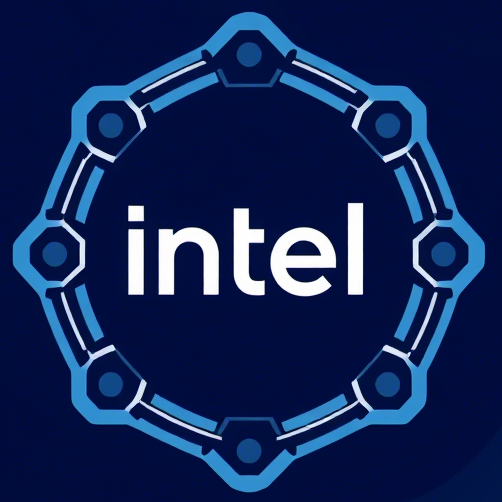
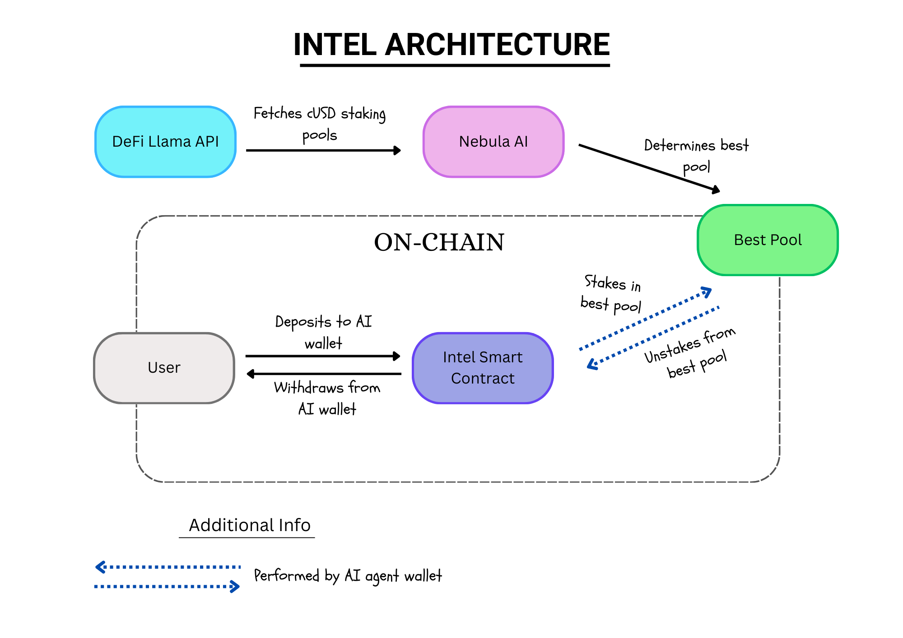

<p align="center">
  
  <h1 align="center">Intel: AI-Optimized DeFi Staking Protocol</h1>
  <p align="center">Maximize your cUSD yields with intelligent, automated liquidity pool allocation</p>
</p>

## Introduction

Intel is an advanced AI-driven staking protocol that automatically allocates cUSD into optimal liquidity pools within the Celo ecosystem.

## Problem Statement

In the world of decentralized finance (DeFi), users often face challenges when trying to optimize their staking and liquidity pool allocations. These challenges include:

- **Complexity**: Manually identifying the best liquidity pools and adjusting stakes requires significant time and expertise.
- **Risk**: Without proper analysis, users may allocate funds to suboptimal pools, leading to lower returns or increased risks.
- **Lack of Automation**: Most existing solutions require constant manual intervention, which can be cumbersome and error-prone.

Intel addresses these issues by providing an automated, AI-driven solution that simplifies the process of staking and optimizing yields.

---

## Solution

Intel introduces an **AI-powered yield optimization protocol** specifically designed for the Celo ecosystem. The key features of Intel include:

- **Automated Allocation**: An intelligent algorithm continuously monitors market conditions and reallocates cUSD across liquidity pools to maximize returns.
- **Risk Management**: Advanced risk assessment ensures that funds are allocated only to low-risk, high-performance pools.
- **Real-Time Adjustments**: The AI agent dynamically adjusts allocations based on real-time data, ensuring optimal performance at all times.
- **User-Friendly Interface**: A simple and intuitive dashboard allows users to track their investments, earnings, and portfolio health effortlessly.

---

## Objectives

The primary objectives of Intel are:

1. **Maximize Returns**: Ensure users earn the highest possible yields on their cUSD stakes.
2. **Minimize Risk**: Protect user assets by avoiding volatile or underperforming liquidity pools.
3. **Simplify Staking**: Provide an easy-to-use platform that eliminates the need for manual intervention.
4. **Promote Accessibility**: Make advanced yield optimization tools accessible to everyone, regardless of technical expertise.

---

## Technologies Used

1.  **Frontend:** Nextjs, Tailwind CSS
2.  **Blockchain:** Celo
3.  **Blockchain integration:** ThirdWeb, Ethers.Js
4.  **ORM:** Prisma
5.  **API integration:** DeFiLlama API
6.  **Nebula AI:** To determine the best pool to stake to.

## Workflow

1. Using the DeFiLlama API, the platform fetchs all Celo-based liquidity pools that support cUSD.
2. Nebula AI analyzes and identifies the most profitable pool from the fetched data, optimizing returns.
3. User sends cUSD to the AI wallet. (Technically, this is sending to Intel smartContract address).
4. Intel AI agent sends funds from the smart contract to the best satking pool address.
5. When user withdraws(i.e Unstake) the ai agent withdraws from the staking pool, goes to the contract address then to the user.

## Intel architecture



## How Intel works

1. **Data Fetching** – The platform uses the DeFiLlama API to fetch all Celo-based liquidity pools supporting cUSD.

2. **AI Optimization** – Nebula AI analyzes the pools and selects the most profitable one.

3. **User Deposit** – Users deposit cUSD into their Intel wallet (Smart Contract Address).

4. **AI Staking** – The AI agent automatically stakes funds in the best available pool.

5. **Withdrawals** – When a user requests a withdrawal, the AI unstakes, routes funds back to the contract, and sends them to the user.

##  Successfully implemented Features

1. **DeFiLlama API Integration** - Fetches live liquidity pool data.

2. **AI driven optimization** - Using Nebula AI to determine the best pool.

3. **Smart Contract deployment** - Manages the staking to staking pools.[https://celoscan.io/address/0x137d84aF92BC35b9C2362dA9DD34b561b339cAf5#code](https://celoscan.io/address/0x137d84aF92BC35b9C2362dA9DD34b561b339cAf5#code)

4. **Real-Time Email Notifications** - Keeps users updated on staking activities.

5. **User-Friendly Dashboard** - Allows users to see their portfolio.

## 🚧 Features under implementation

**AI-Driven Smart Contract Integration**

- Developing a smart account on Thirdweb, which will serve as the AI wallet. This will facilitate seamless fund transfers between the smart contract and staking pools, ensuring automated staking with zero friction.

**Intelligent Unstaking & Fund Reallocation**

- Implementing a cron job to continuously monitor liquidity pools for the most optimal staking opportunities. If a better pool is identified, the AI agent will dynamically unstake and reallocate funds to maximize returns.

**Enhanced UI/UX for a Superior User Experience**

- Refining the platform’s interface and interactions to deliver a more intuitive and engaging experience, ensuring smooth navigation and improved accessibility for all users

## Demo

1. To create your Intel account, visit our live website: [https://intel-mocha.vercel.app/](https://intel-mocha.vercel.app).
2. Watch our video demo here: [Video Link](https://www.loom.com/share/5697f980a00e4bb49f746d743cab93ab?sid=0f281e5c-c262-42dd-abb8-d4298851ef29).

---

## Getting Started

### Prerequisites

Before running the project locally, ensure you have the following installed:

- **Node.js**: Version 16 or higher.
- **npm**: Node Package Manager (comes with Node.js).

### Steps to Run Locally

1. Clone the repository to your machine:

   ```bash
   git clone https://github.com/jeffIshmael/Intel.git

   ```

2. navigate into the project directory.

   ```bash
    cd Intel/intelApp

   ```

3. Install the dependencies.

   ```bash
    npm install

   ```

4. Run the development server.

   ```bash
    npm run dev

   ```

---

## Contact

For any questions or feedback, feel free to reach out to us:

Email: [inteldevs@gmail.com](intelai24@gmail.com).
